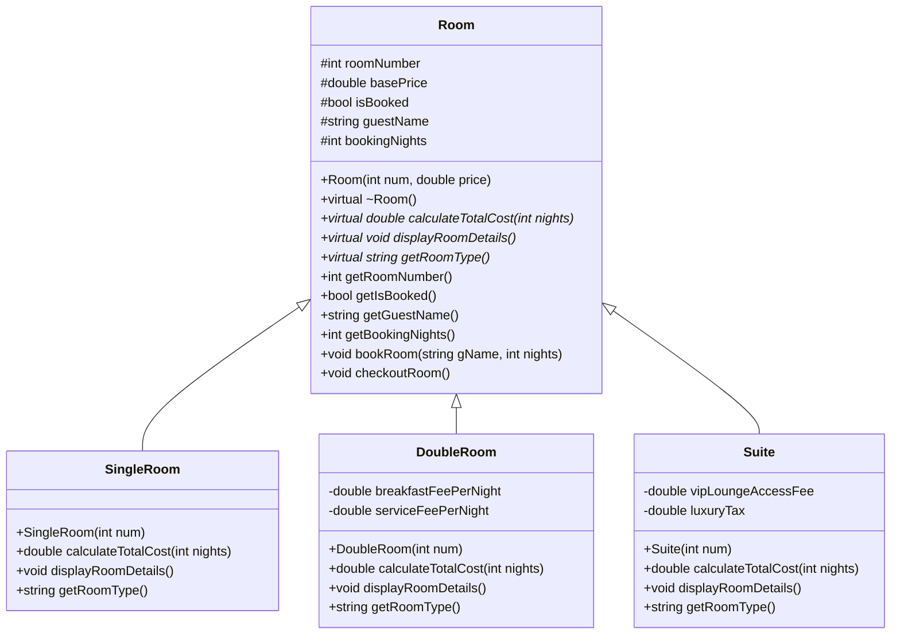

# 期末專題報告：智慧型訂房與客房管理系統 (C++ Terminal Hotel Booking System)

---

## 1. 專案基本資訊 (Cover Page)

* **專案名稱**：智慧型訂房與客房管理系統
* **開發語言**：C++ (C++17 標準)
* **開發工具**：GCC / MinGW-w64 Compiler, Windows Terminal
* **設計模式**：物件導向設計 (OOP)、規格驅動開發 (OpenSpec SDD)
* **GitHub 倉庫網址**：[https://github.com/xiangyi-cmd/cppproject](https://github.com/xiangyi-cmd/cppproject)

---

## 2. 系統架構與功能說明 (System Architecture)

### 2.1 物件導向設計與多型 (OOP & Polymorphism)
本系統的核心是設計一個客房管理層級。以基底類別 `Room` 為主體，實作三大純虛擬函式以展現多型特徵，並繼承出三種不同計費機制的客房：

* **`Room` (基底類別)**：定義共用屬性（房號、基本房價、預訂狀態、住客姓名、天數）與純虛擬函式：
  - `virtual double calculateTotalCost(int nights) const = 0` (多型計費)
  - `virtual void displayRoomDetails() const = 0` (多型規格展示)
  - `virtual std::string getRoomType() const = 0` (多型房型回傳)
* **`SingleRoom` (單人房)**：預設房價 $1000/晚。總費用 = 基本房價 * 天數。
* **`DoubleRoom` (雙人房)**：預設房價 $1800/晚。每日房價另包含早餐費 $250 與服務費 $150。總費用 = (基本房價 + 服務費 + 早餐費) * 天數。
* **`Suite` (總統套房)**：預設房價 $5000/晚。包含一次性 VIP 貴賓室使用費 $1000，以及 10% 奢侈稅。總費用 = ((基本房價 * 天數) + 貴賓室費) * 1.1。

#### 類別關係圖 (Class Diagram)


### 2.2 核心管理功能
由 `HotelManager` 類別統籌管理所有的業務邏輯與資料流：
* **STL 容器與智慧指標**：使用 `std::vector<std::shared_ptr<Room>>` 儲存多型客房，透過智慧指標（Smart Pointers）進行安全的生命週期管理，杜絕記憶體洩漏（Memory Leak）。
* **歷史訂單記錄**：使用 `std::vector<BookingRecord>` 保存開機以來的交易明細，以利營運統計。
* **資料持久化 (File I/O)**：
  - 開機自動載入客房狀態（`data/rooms.csv`）及歷史訂單（`data/bookings.csv`），系統可恢復前次關機前的狀態。
  - 關機自動將最新狀態寫入 CSV 檔案覆蓋，保證資料永不丟失。
* **搜尋與排序 (Algorithms & Lambda)**：
  - 搜尋：使用 `std::find_if` 搭配 Lambda 快速定位房號。
  - 排序：使用 `std::sort` 搭配自訂 Lambda，提供「依房號排序」與「依房價由低到高排序」兩種檢視模式。

### 2.3 UI 介面優化（第二至第五版）
* **跨平台自動清屏 (Screen Clear)**：結合 `std::system("cls")`，於進入主選單與子選單時主動清空終端機歷史，實現乾淨的單一畫面體驗。
* **方向鍵互動式選單 (Arrow-Key Navigation)**：引入 `<conio.h>` 的 `_getch()` 監聽鍵盤事件。使用者可利用鍵盤上下方向鍵（↑ / ↓）移動高亮指標 `=>`，並按 Enter 鍵確認選擇，完全擺脫數字輸入的繁瑣操作。
* **動態選單篩選**：
  - 辦理入住：自動篩選出所有「空閒客房」供選擇，滿房時主動防呆提示。
  - 辦理退房：自動篩選出所有「已入住客房」供選擇，無入住房間時主動提示。

---

## 3. 程式執行畫面與說明文字 (Screenshots & CLI Mockups)

以下為程式在 Windows Terminal/CMD 中的實際執行畫面文字版 mockup 及功能說明：

### 3.1 歡迎與載入畫面
當程式啟動時，會從背景 CSV 檔案讀取所有客房設定。
```text
============================================
    歡迎使用「智慧型訂房與客房管理系統」
============================================
正在載入客房與預訂資料...
客房資料載入成功！
歷史預訂紀錄載入成功！
```

### 3.2 互動式主選單
載入完成後會立即清屏，並繪製方向鍵高亮選單。使用者按 `↓` 下移高亮。
```text
================== 主選單 ==================
    1. 查看所有客房狀態 (List All Rooms)
 => 2. 條件篩選與搜尋 (Search & Filter)
    3. 辦理入住 / 預訂房間 (Book a Room)
    4. 辦理退房結帳 (Check-Out & Invoice)
    5. 查看飯店營運統計 (View Statistics)
    6. 儲存並退出系統 (Save & Exit)
============================================
提示：使用 ↑ / ↓ 鍵移動，按 Enter 鍵確定選擇
```

### 3.3 視覺化房態牆 (顯示所有客房狀態)
選擇 `1` 進入，並以方向鍵選擇排序規則後，系統將以 ANSI 色彩繪製房態牆（空閒為綠色，已預訂為紅色）。
```text
[查看房間狀態]

========================================================================
房號      客房類型         基本房價         狀態             住客姓名 (入住天數)
------------------------------------------------------------------------
101       單人房          $1000            [空閒]         
102       單人房          $1000            [已預訂]          張三 (3 晚)
103       單人房          $1000            [空閒]         
201       雙人房          $1800            [空閒]         
202       雙人房          $1800            [空閒]         
301       總統套房        $5000            [已預訂]          李四 (2 晚)
========================================================================

按 Enter 鍵回主選單...
```

### 3.4 辦理入住選單 (自動篩選空房)
選擇 `3. 辦理入住 / 預訂房間` 後，系統自動隱藏已被預訂的 102 與 301 房，僅列出剩餘的 4 間空房，供管理員選取。
```text
================== [辦理入住 - 選擇預訂客房] ==================
 => 1. 房號 101 (單人房) - $1000 / 晚
    2. 房號 103 (單人房) - $1000 / 晚
    3. 房號 201 (雙人房) - $1800 / 晚
    4. 房號 202 (雙人房) - $1800 / 晚
    5. 返回主選單
============================================
提示：使用 ↑ / ↓ 鍵移動，按 Enter 鍵確定選擇
```
選取 101 房後，系統會清屏，展示該客房的詳細資訊，並引導輸入客名與入住天數，完成多型計費與存檔：
```text
================== [辦理入住 / 預訂房間] ==================

--- 客房詳細資訊 ---
房號: 101
類型: 單人房 (Single Room)
基本房價: $1000 / 晚
預訂狀態: 空閒 (Available)
備註: 簡約大方，適合單人出差旅遊。
---------------------
請輸入住客姓名: 王五
請輸入預計入住天數 (1-30天): 2

🎉 預訂成功！已產生訂單資訊：
----------------------------------------
訂單編號: BK_1719236100
住客姓名: 王五 先生/女士
房號: 101 (單人房)
入住天數: 2 晚
總費用：$2000 元
----------------------------------------

按 Enter 鍵回主選單...
```

### 3.5 辦理退房選單 (自動篩選已預訂客房並多型計費)
選擇 `4. 辦理退房結帳` 後，選單只會顯示當前已被預訂的房間（102、301，以及剛預訂的 101）。我們可以用方向鍵選擇 301 房進行退房：
```text
================== [辦理退房結帳 - 選擇退房客房] ==================
    1. 房號 101 (單人房) - 住客: 王五
    2. 房號 102 (單人房) - 住客: 張三
 => 3. 房號 301 (總統套房) - 住客: 李四
    4. 返回主選單
============================================
提示：使用 ↑ / ↓ 鍵移動，按 Enter 鍵確定選擇
```
按下 Enter 後，系統自動調用 `Suite` 的 `calculateTotalCost()` 方法（多型機制），計算總費用（(5000 * 2 晚 + 1000 貴賓室費) * 1.1 奢侈稅 = 12100），印出發票明細：
```text
================ 退房結帳明細 ================
房號: 301
類型: 總統套房 (Suite Room)
基本房價: $5000 / 晚
附加費用: 一次性 VIP 貴賓室使用費 ($1000)、奢侈稅 (加收總額 10%)
預訂狀態: 已預訂 (住客: 李四, 天數: 2 晚)
備註: 豪華行政套房，享專屬高空貴賓室使用權。
預訂天數: 2 晚
結帳總額: $12100 元
==============================================
退房手續完成！房間已釋放為空房。

按 Enter 鍵回主選單...
```

### 3.6 營運統計報告
選擇 `5. 查看飯店營運統計` 後，系統會基於歷史訂單數據計算累積營業額與住房率：
```text
================ 飯店營運統計報告 ================
總客房數: 6 間
已入住房: 2 間
目前住房率: 33.3 %
歷史累積營業額: $14100 元
歷史訂單總筆數: 2 筆
==================================================

按 Enter 鍵回主選單...
```

---

## 4. 系統開發總結與 GitHub 網址 (Summary & GitHub URL)

本專案將複雜的 C++ 物件導向技術（繼承、虛擬解構子、多型）與 STL 演算法有機地結合，並透過規格驅動的 OpenSpecSD 流程進行了 5 次的版本迭代，最終製作出一個畫面乾淨、支援鍵盤方向鍵上下游標與 Enter 選取的精緻控制台應用程式。

* **專案的開源 GitHub 倉庫連結**：[https://github.com/xiangyi-cmd/cppproject](https://github.com/xiangyi-cmd/cppproject)
