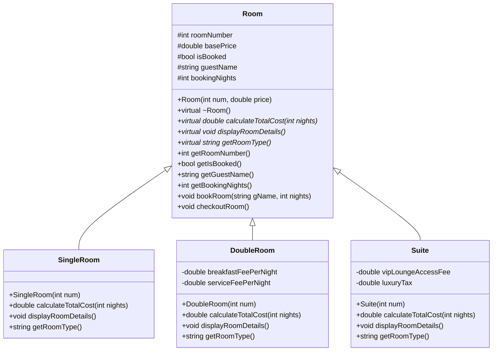

# OpenSpec 系統規格書：智慧型訂房與客房管理系統 (Hotel Booking System)

本規格書為「智慧型訂房與客房管理系統」的單一真理來源 (Source of Truth)。系統使用 C++ 開發，模擬飯店大廳櫃台的客房預訂與管理作業。

---

## 1. 系統架構與類別繼承設計 (OOP Class Hierarchy)

本系統使用物件導向的繼承與多型機制來管理不同類型的客房。

### 類別關係圖 (Class Diagram)



### 類別屬性說明

#### 基底類別：`Room`
* 房號 (`roomNumber`)、基本房價 (`basePrice`)、預訂狀態 (`isBooked`)、住客姓名 (`guestName`)、預訂天數 (`bookingNights`)。
* 虛擬解構子：`virtual ~Room()`。
* 純虛擬/虛擬函式：
  * `calculateTotalCost(int nights)`：計算住房總費用（多型核心）。
  * `displayRoomDetails()`：輸出客房詳細屬性（多型核心）。
  * `getRoomType()`：回傳客房類別名稱字串。

#### 衍生類別：`SingleRoom` (單人房)
* 預設房價：$1000 / 晚。
* 計費邏輯：`基本房價 * 天數`。

#### 衍生類別：`DoubleRoom` (雙人房)
* 預設房價：$1800 / 晚。
* 額外費用：每晚包含服務費 $150 與雙人早餐費 $250。
* 計費邏輯：`(基本房價 + 服務費 + 早餐費) * 天數`。

#### 衍生類別：`Suite` (總統套房)
* 預設房價：$5000 / 晚。
* 額外費用：包含 VIP 貴賓室使用費 $1000，以及一次性奢侈稅加收 10%（即總價的 1.1 倍）。
* 計費邏輯：`((基本房價 * 天數) + 貴賓室費) * 1.1`。

---

## 2. 資料存儲格式 (Data Storage)

系統使用 CSV (逗號分隔值) 格式持久化儲存客房狀態與歷史訂單。

### 2.1 客房狀態檔 (`data/rooms.csv`)
格式：`房號,客房類型,基本房價,是否已被預訂,住客姓名,預訂天數`
範例：
```csv
101,Single,1000,0,,0
102,Single,1000,1,張三,3
201,Double,1800,0,,0
301,Suite,5000,1,李四,2
```

### 2.2 歷史訂單檔 (`data/bookings.csv`)
格式：`訂單編號,住客姓名,房號,客房類型,入住天數,總收費金額`
範例：
```csv
BK_1719234900,張三,102,Single,3,3000
BK_1719235000,李四,301,Suite,2,12100
```

---

## 3. STL 應用設計 (STL Containers & Algorithms)

* `std::vector<std::shared_ptr<Room>>`：儲存所有客房物件指標。使用 `shared_ptr` 是為了安全管理記憶體並支援基底指標指向衍生類別的多型操作。
* `std::vector<BookingRecord>`：儲存載入的歷史訂單。
* `std::find_if`：用於依據「房號」尋找特定的客房。
* `std::sort` 與 Lambda：用於將房間清單按「房型」、「價格」或「預訂狀態」進行排序。

---

## 4. UI 操作流程與終端機介面設計 (Terminal UI)

### 4.1 畫面色彩規範 (ANSI Colors)
* 綠色背景/文字：代表「空閒（Available）」客房。
* 紅色背景/文字：代表「已被預訂（Booked）」客房。
* 藍色/青色文字：用於表格邊框與系統提示。

### 4.2 主選單架構
```text
==================================================
           智慧型訂房與客房管理系統
==================================================
 1. 查看所有客房狀態 (Visual Room Status)
 2. 搜尋可用客房 (Search Rooms)
 3. 辦理入住預訂 (Check-In / Book)
 4. 辦理退房結帳 (Check-Out)
 5. 查看營運統計 (Business Reports)
 6. 儲存並結束程式 (Save & Exit)
==================================================
請輸入您的選擇 (1-6): 
```

### 4.3 輸入防呆設計
當系統要求輸入數字（如選擇天數或選單）時，若使用者輸入了英文或特殊字元，系統將清除輸入緩衝區（`cin.clear()` 及 `cin.ignore()`），並提示錯誤重新輸入，絕不產生死循環或崩潰。
